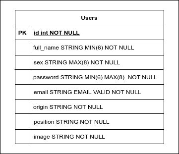

# API Simples de Autenticação do Usuário

## Boas vindas ao repositório do Projeto - Api Auth Java

Esse projeto teve como proposta a criação de uma api geral para autenticação de um usuário qualquer que tenha em seu cadastro todos os dados válidos pedidos pela api de autenticação, foi decidido criar essa api para desenvolver um projeto **Back-End** em Java que ajude na parte de autenticação no front-end do projeto [Pokemon Marketplace](https://github.com/dudawiltiner/pokemon-marketplace-accenture). O resultado final é uma API para **cadastrar, atualizar e autenticar usuários, e modificar as senhas dos mesmos** salvos num único banco de dados **SQL** através de uma **API RESTFull**.


### As ferramentas principais utilizadas foram:

[Java](https://www.java.com/pt-BR/)<br>
[Intelli J IDE](https://www.jetbrains.com/idea/)<br>
[Spring Boot](https://spring.io/projects/spring-boot)<br>
[Swagger](https://swagger.io/docs/)<br>

---

## Sumário

- [Como rodar a aplicação](#como-rodar-a-aplicação)
  - [Clonando o Repositório](#clonando-o-repositório)
  - [Usando o link do deploy da API](#usando-o-link-do-deploy-da-api)
- [API](#api)
  - [Users](#users)
---

## Como rodar a aplicação

### Clonando o repositório

Após cada um dos passos a seguir, haverá um exemplo do comando a ser digitado para fazer o que está sendo pedido, caso tenha dificuldades e o exemplo não seja suficiente, não hesite em me contatar em _eduardawiltiner@gmail.com_.

1. Abra o terminal e crie um diretório no local de sua preferência com o comando **mkdir**:
```javascript
  mkdir api-java
```

2. Entre no diretório que acabou de criar e depois clone o projeto:
```javascript
  cd api-auth-java
  git clone https://github.com/dudawiltiner/api-auth-java.git
```

### Rodando a aplicação pelo IntelliJ

3. Entre no diretório criado após a clonagem do repositório. No caso de uso do IntelliJ, rodea aplicação no arquivo, na pasta Main:
```javascript
  AuthJavaApplication
```

### Rodando a aplicação pelo terminal usando Maven

4. Você pode usar o Maven instalado para rodar aplicação, digitando o seguinte comando:
```javascript
  mvn exec:java -Dexec.mainClass="api.authjava.AuthJavaApplication"
```

### Usando a API

5. Você pode usar a API pelo Postman usando o seu localhost na porta 8080:

```javascript
  http://localhost:8080/{rota}
```

Os verbos e cada rota podem ser consultados nessa secção do repositório: [API](#api) ou no link da documentação da API Swagger: ```https://api-auth-java.herokuapp.com/swagger-ui.html```.

### Usando o link do deploy da API

6. Você pode usar a API que já está no ar, hospedada no Heroku disponiblizada nesse link: ```https://api-auth-java.herokuapp.com/```. Seguindo o que está na documentação e aqui no respositório.

## API

A Api é composta uma única rota (**users**) com suas consultas a tabela Users no banco de dados.  A tabela contém todos os dados pedidos num login no Mockup entregue no projeto de front-end e também todas as informações pedidas na alteração do perfil.

Para entender melhor abaixo está uma imagem do Diagrama ER(Entidade Relacionamento).

<div align="center">
  
</div>

###
Logo abaixo, para cada rota da API foi feita uma tabela explicando. Porém, a documentação de todas as rotas e muito mais como usa-las você pode encontrar, após incializar aplicação, através da rota: ```/swagger-ui.html``` carregada no seu próprio browser ou usando a API hospedada no Heroku: ```https://api-auth-java.herokuapp.com/swagger-ui.html```.


### Users


| MÉTODO |  ROTA  |              DESCRIÇÃO              |             REQUISIÇÃO(VALUES)             |               RESPOSTA              |
|:------:|:-----:|:-----------------------------------:|:------------------------------------------:|:-----------------------------------:|
|  POST  | /users/auth | Rota para encontrartrar e autenticar um usuário | Deve receber um json com o email e a senha | Dando sucesso, retorna um json com o usuário encontrado |
|  POST  | /users/saveuser | Rota para cadastrar um novo usuário | Deve receber um json com o email, full_name, password, image, sex, origin e position | Dando sucesso, retorna uma mensagem de confirmação |
|  PUT  | /users/updateuser | Rota para atualizar um usuário | Deve receber um json com o email, full_name, password, image, sex, origin e position | Dando sucesso, retorna um json com o usuário atualizado |
|  PUT  | /users/password | Rota para atualizar a senha do usuário | Deve receber um json com o email e a senha | Retorna uma mensagem de confirmação |


